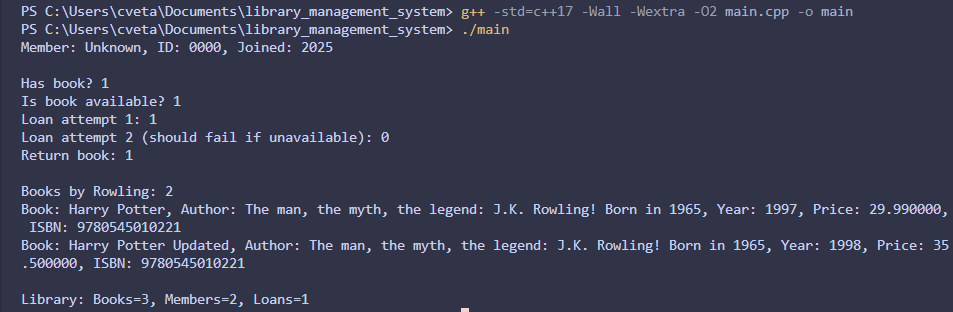

# Проект: Библиотечна Система (Library Management System)

## Описание

Проектът „Библиотечна система" представлява малка C++ система, която моделира работа с книги, автори, членове и заеми в библиотека чрез пет взаимосвързани класа — `Author`, `Book`, `Member`, `Loan`, `Library`.

Той демонстрира прилагането на основни обектно-ориентирани концепции в C++:

- конструктори и деструктори
- капсулация и достъп чрез getters и setters
- const-коректност и валидация на данни
- статични членове и методи
- Rule of 3/5
- добри ООП практики в реалистичен контекст

<hr>

## Структура на проекта

```
homework_1/
├── Author.h
├── Book.h
├── Member.h
├── Loan.h
├── Library.h
├── README.md
├── main.cpp
└── main
```

<hr>

## Компилация и изпълнение

Отворете терминал в директорията `library_management_system/` и изпълнете:

```bash
g++ -std=c++17 -Wall -Wextra -O2 main.cpp -o main
```

След това стартирайте програмата:

```bash
./main
```

<hr>

## Примерен изход

```
Member: , ID: , Joined: 1878049856

Has book? 1
Is book available? 1
Loan attempt 1: 1
Loan attempt 2 (should fail if unavailable): 0
Return book: 1

Books by Rowling: 2
Book: Harry Potter, Author: The man, the myth, the legend: J.K. Rowling! Born in 1965, Year: 1997, Price: 29.990000, ISBN: 9780545010221
Book: Harry Potter Updated, Author: The man, the myth, the legend: J.K. Rowling! Born in 1965, Year: 1998, Price: 35.500000, ISBN: 9780545010221

Library: Books=3, Members=2, Loans=1
```

<hr>

## Класове

### Клас Author

Представя автор с основни характеристики.

**Членове:**
- `std::string name` — име на автора
- `int birthYear` — година на раждане

**Методи:**
- `Author()`— конструктор по подразбиране
- `Author(const std::string& name, int birthYear)`— параметризиран конструктор със списък за инициализация
- `setName(const std::string& name)`— задава стойност на името, с валидация за празно подадено такова
- `getName() const` — връща името
- `setBirthYear(int year)`— задава годината с валидация за невалидна подадена такава (< 1850 или > 2025) 
- `getBirthYear()`—  връща годината на раждане
- `to_string() const`—  Използва се за получаване на текстово представяне на обекта.

<hr>

### Клас Book

Представя книга с основни характеристки

**Членове:**
- `std::string title` — заглавие
- `Author author` — автор
- `int year` — година
- `double price` — цена
- `std::string isbn` — ISBN
- `static int totalBooks` — общ брой книги

**Методи:**
- `Book()` | `Book(const std::string& title, const Author& author, int year, double price, const std::string& isbn)` | `Book(const Book&)` | `Book(Book&&)` — Rule of 5
- `operator=`, `operator=(Book&&)` - съответно копиращ и преместващ оператор
- `~Book()` - деструктор, при извикване общия брой книги се намалява с 1
- `setPrice(double price)`, `getPrice()` - сет и гет методи за цената, проверка за неотрицателност
- `setYear(int year), getYear()` - сет и гет методи за годината, валидиране на годината
- `setTitle(const std::string& title)`, `setISBN(const std::string& id)` - и двата метода проверяват за празно подаване, ако не - задават съответната стойност
- `getAuthor() const`, `getTitle() const`, `getISBN() const`
- `to_string() const`— Използва се за получаване на текстово представяне на обекта.
- `static int getTotalBooks()`— връща общия брой книги 

<hr>

### Клас Member
Представлява член от библиотеката

**Членове:**:

- `std::string name` — име
- `std::string memberId` — уникален идентификатор
- `int yearJoined` — година на присъединяване
**Методи:**:
- `Member()` | `Member(std::string name, const std::string memberId, int yearJoined)` — конструктори със съответно стойности по подразбиране и параметизиран със списък за инициализация
- `setName(const std::string& name)`, `getName() const`
- `setMemberId(const std::string& memberId)`, `getMemberId() const`
- `setYearJoined()`, `getYearJoined()`— get & set методи за съответните полета
- `to_string() const`— Използва се за получаване на текстово представяне на обекта.

<hr>

### Клас Loan
Представя заем за книга

**Членове:**
- `std::string isbn` -isbn на книгата
- `std::string memberId` - индентификатор на члена
- `std::string startDate`- начална дата
- `std::string dueDate`- крайна дата
- `bool returned`- дали книгата е върната

**Методи:**
- `Loan(const std::string& isbn, const std::string& memberId, const std::string& startDate, const std::string& dueDate)` - параметизиран конструктор със списък за инициализация
- `markReturned()` - задава стойност на `returned` = `true`
- `isOverdue(const std::string& today)` - проверява дали книгата е просрочена
- `getISBN() const` | `getMemberId() const` | `getStartDate() const` | `getDueDate() const`- всеки от методите връща съответните стойности от съответното поле
- `to_string() const`— Използва се за получаване на текстово представяне на обекта.

<hr>

### Клас Library
Представя библиотека, която управлява заеми, книги и членове

**Членове:**
- `std::vector<Book> books`- списък с книги
- `std::vector<Member> members`- списък с членове
- `std::vector<Loan> loans`- списък със заеми

**Методи**
- `addBook(const Book& b)` - добавя нова книга към списъка с книгите
- `addMember(const Member& m)` - добавя нов член към списъка с членовете
- `hasBook(const std::string& isbn) const` - проверява дали има определена книга, търси по isbn
- `isBookAvailable(const std::string& isbn) const` - проверява дали книгата няма неприключен заем
- `loanBook(const std::string& isbn, const std::string& memberId, const std::string& start, const std::string& due)`- прави заем за книга
- `returnBook(const std::string& isbn, const std::string& memberId)`-връща книга
- `findByAuthor(const std::string& authorName) const`- търси книга по името на автора
- `to_string() const`— Използва се за получаване на текстово представяне на обекта.

<hr>

## Образователни цели

Проектът има за цел да демонстрира:

- разделение между интерфейс (.h) и имплементация (.cpp);
- прилагане на Rule of  3/5
- използване на списъци за инициализация
- валидация и обработка на изключения
- работа със статични членове
- прилагане на const-коректност

<hr>

## Екранна снимка


<hr> 

## Технологии

- C++17
- g++ / GCC

<hr>

## Автор

**Име:** Цветан Златев <br>
**Номер:** 22328 <br>
**Курс:** Обектно-ориентирано програмиране (C++) <br>
**Дата:** 05.12.2025 г.

